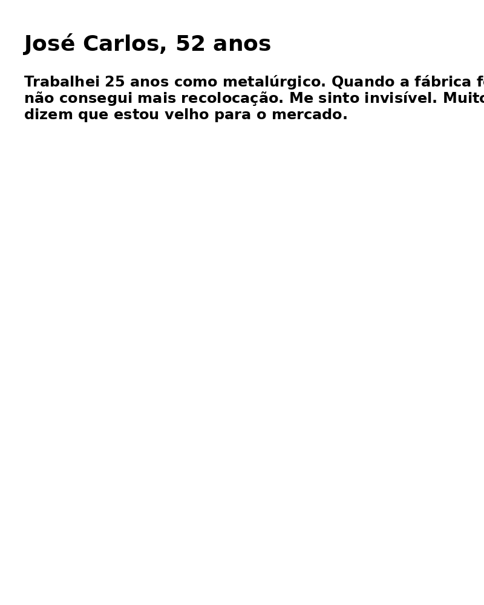
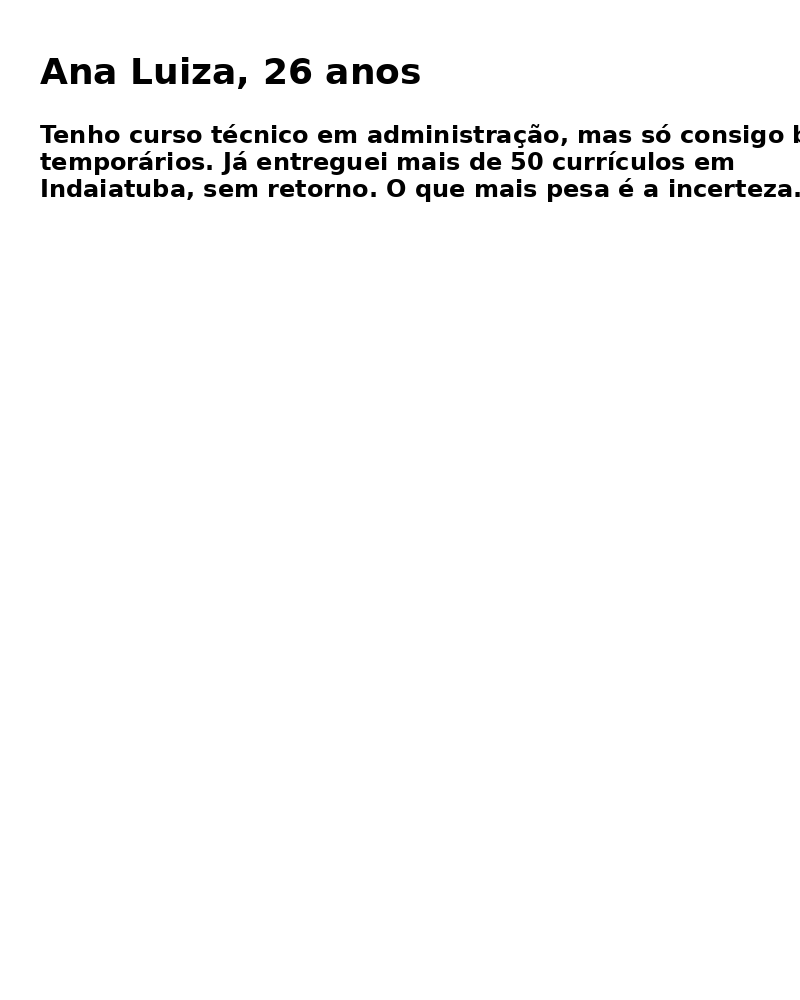
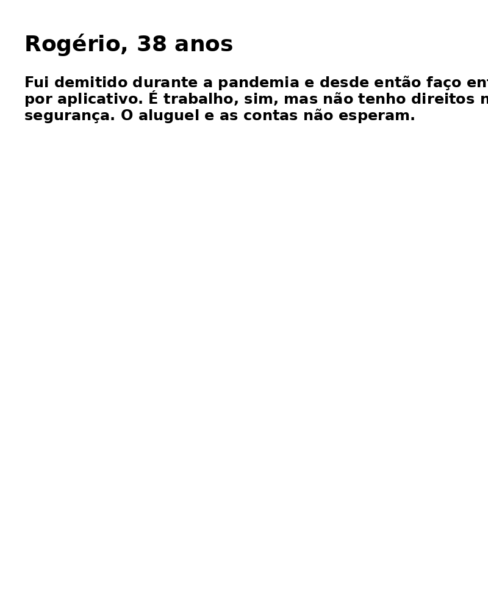
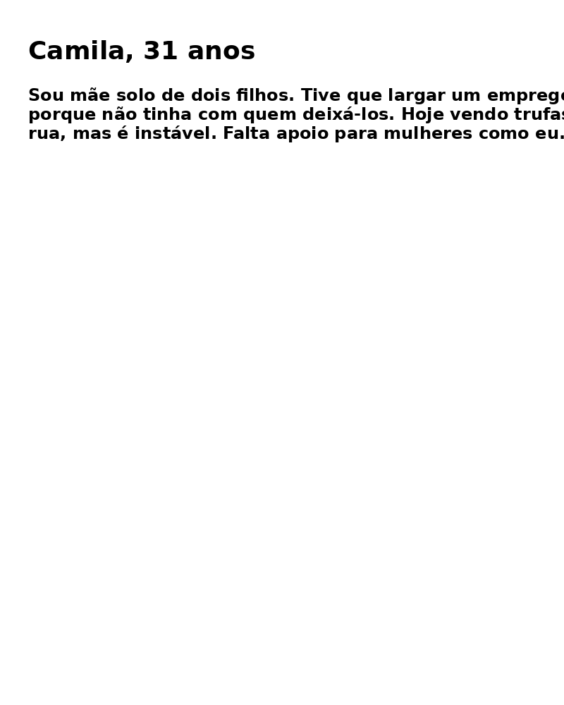
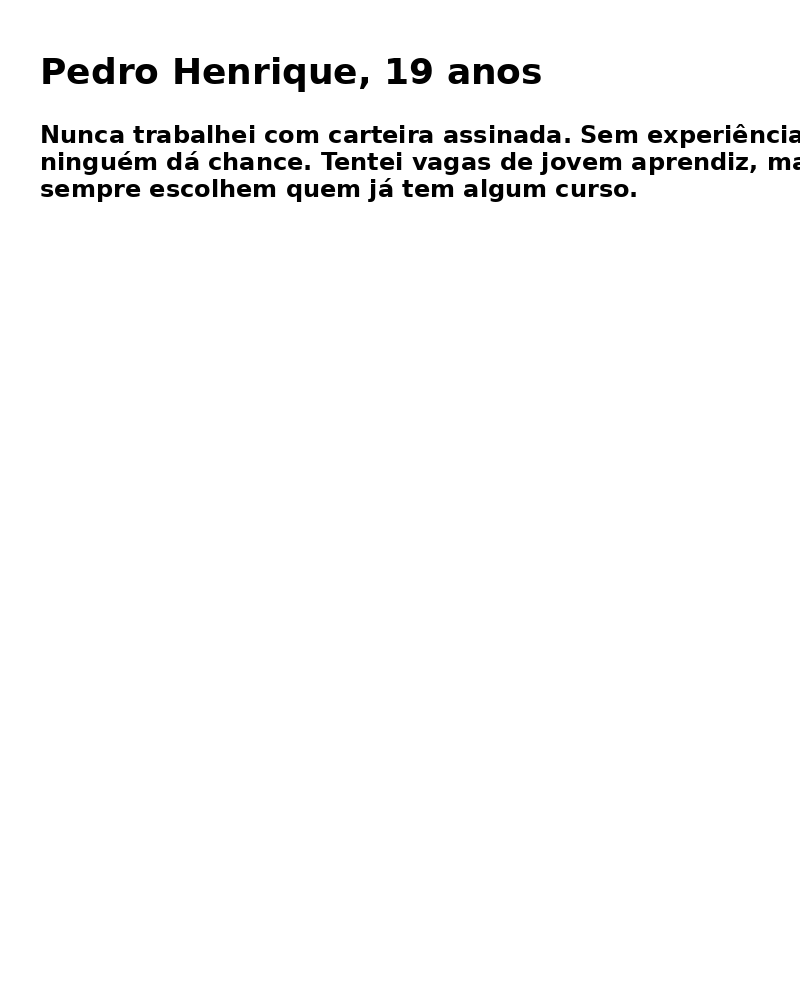
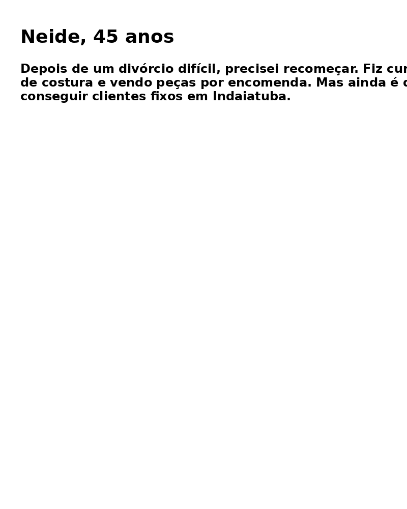
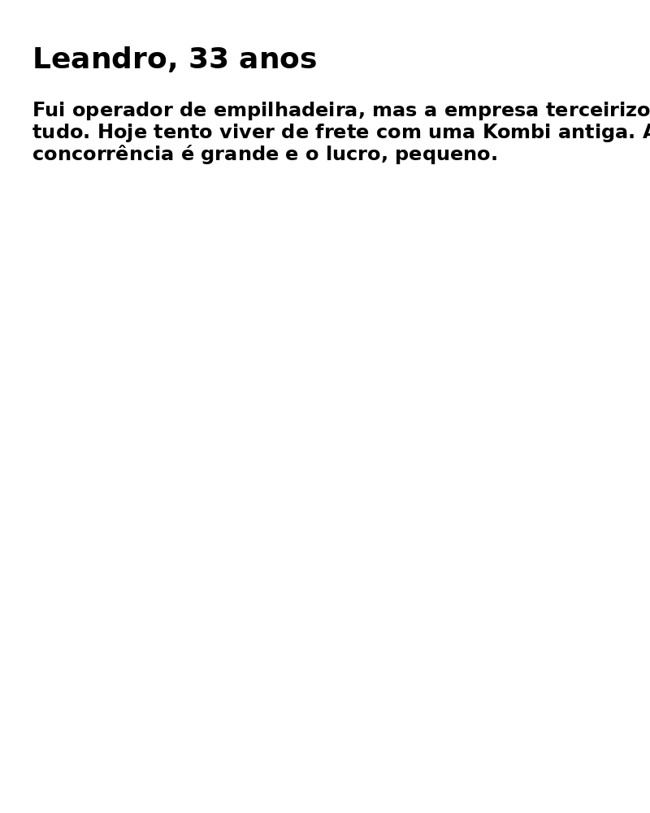
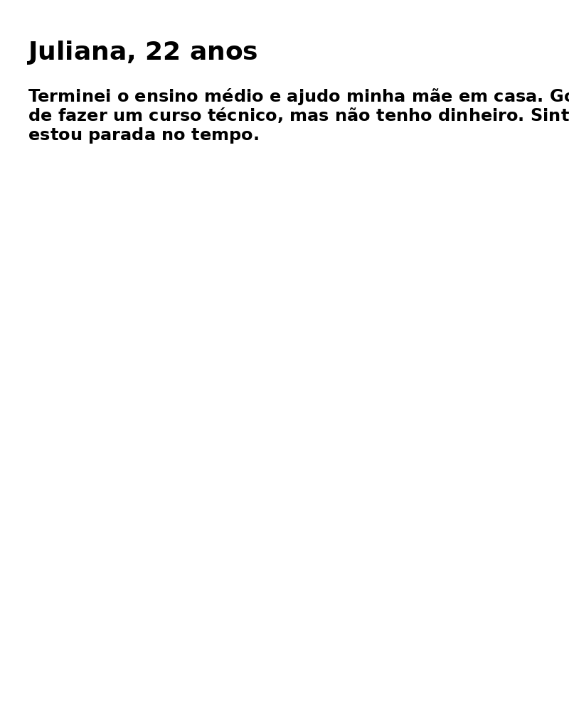
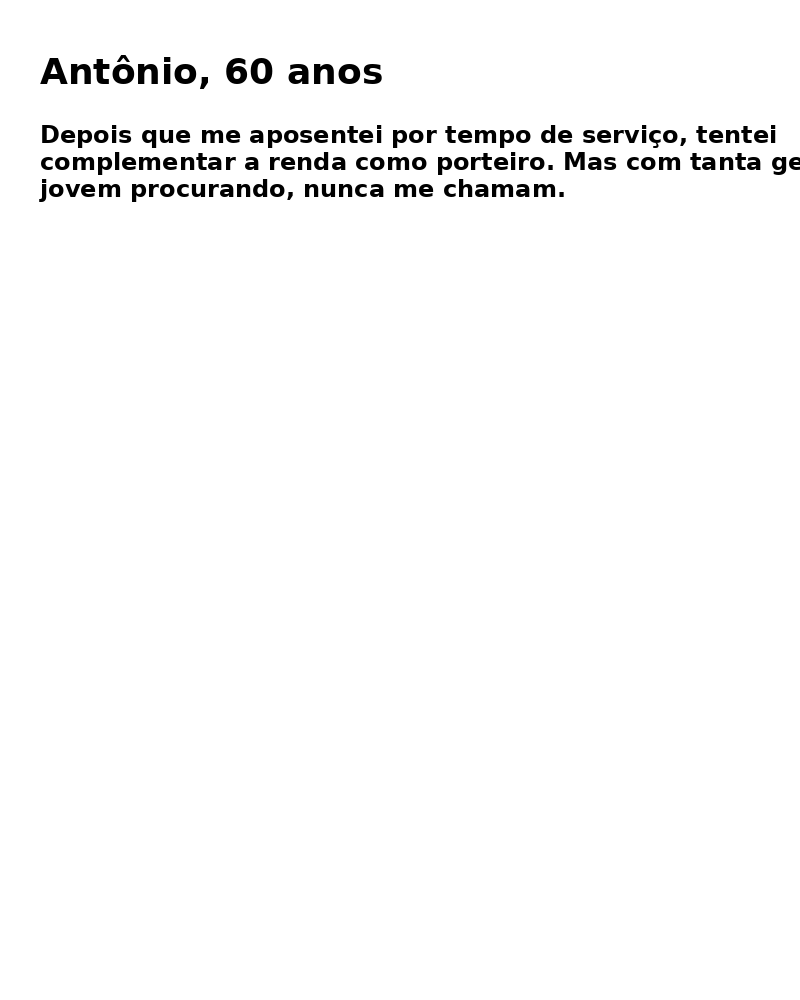
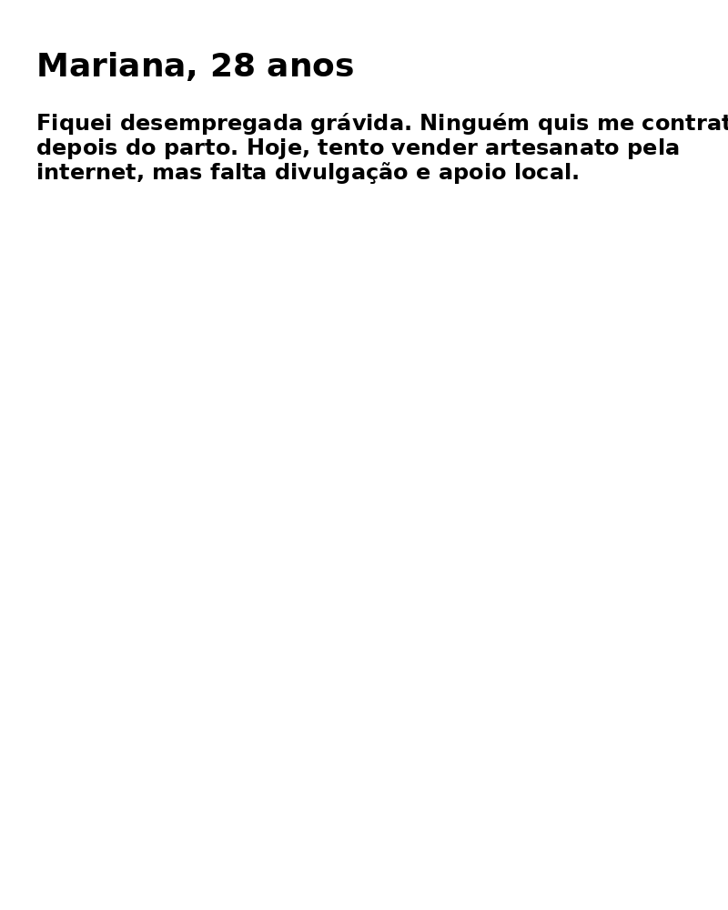

<!DOCTYPE html>
<html lang="pt-BR">
<head>
  <meta charset="UTF-8">
  <meta name="viewport" content="width=device-width, initial-scale=1.0">
  <title>Vidas em Espera - Exposição</title>
  
</head>
<body>
  <header>
    <h1>Vidas em Espera</h1>
    
Uma exposição sobre o desemprego em Indaiatuba

  </header>

  <section>
    <h2>Introdução</h2>
    
Esta exposição reúne relatos reais de moradores de Indaiatuba que enfrentam o desemprego. Cada imagem carrega uma história de luta, superação e esperança. Nosso objetivo é dar visibilidade a essas vozes e inspirar empatia, reflexão e ação.

  </section>

  <section>
    <h2>Depoimentos</h2>
    

      

        
        
<strong>José Carlos, 52 anos</strong> "Me sinto invisível. Muitos dizem que estou velho para o mercado."

      

      

        
        
<strong>Ana Luiza, 26 anos</strong> "Já entreguei mais de 50 currículos, sem retorno."

      

      

        
        
<strong>Rogério, 38 anos</strong> "Faço entregas por aplicativo, sem direitos nem segurança."

      

      

        
        
<strong>Camila, 31 anos</strong> "Vendo trufas na rua, mas falta apoio para mães solo."

      

      

        
        
<strong>Pedro Henrique, 19 anos</strong> "Sem experiência, ninguém me dá uma chance."

      

      

        
        
<strong>Neide, 45 anos</strong> "Vendo roupas por encomenda, mas faltam clientes fixos."

      

      

        
        
<strong>Leandro, 33 anos</strong> "Tento viver de frete com uma Kombi antiga."

      

      

        
        
<strong>Juliana, 22 anos</strong> "Gostaria de estudar, mas falta condição financeira."

      

      

        
        
<strong>Antônio, 60 anos</strong> "Me aposentei, mas preciso complementar a renda."

      

      

        
        
<strong>Mariana, 28 anos</strong> "Ninguém quis me contratar após a gravidez."

      

    

  </section>

  <section>
    <h2>Sobre o Projeto</h2>
    
Este projeto foi desenvolvido a partir da observação direta, de questionários aplicados na comunidade e do desejo de dar visibilidade às histórias de quem vive o desemprego. As imagens e relatos aqui apresentados foram coletados com respeito, empatia e autorização dos participantes.

  </section>

  <section>
    <h2>Participe e Compartilhe</h2>
    
Compartilhe esta exposição nas suas redes sociais, converse com seus vizinhos e apoie pequenos empreendedores locais. Pequenas ações geram grandes mudanças.

    
<a href="Cartazes_Depoimentos_Indaiatuba.pdf" target="_blank">Baixar exposição completa em PDF</a>

  </section>

  <footer>
    
Projeto criado por [Rebeca Bernardo] | Indaiatuba - 2025

  </footer>
</body>
</html>
